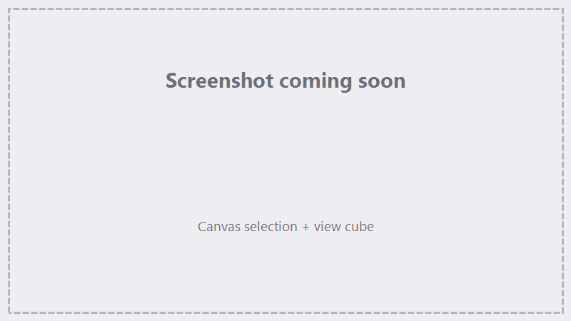

# The Canvas (Design & Preview)

The canvas is where you place, orient, and preview your work. The toolbar **Preview toggle** switches
between the **Sequencer** layout and the **Preview**.

## 2D vs. 3D view

- **2D** — the flat design view for 2D art.
- **3D** — a perspective view for 3D imports and 3D-slice previews. Switching to a 3D Slice action puts the
  canvas in 3D mode.

## Navigating

| Action | How |
|---|---|
| **Zoom** | Mouse wheel |
| **Pan** | Right-click drag |
| **Orbit** (3D) | Middle-click drag |
| **Snap to a view** (3D) | Click a face/edge of the **view cube** |
| **Perspective ⇄ orthographic** (3D) | Projection toggle button (top row) |
| **Reset view** | Reset button |
| **Zoom to fit** | Fit-to-content button |

## Selecting & editing

- **Click** an object to select it; multi-select within a layer.
- Selecting in the **layer tree** highlights the object on the canvas, and vice-versa.
- **Nudge** the selection with the arrow keys (step sizes are set in [Preferences](projects-files.md)).
- Use the **Position / Size / Rotation** controls (and link/unlink X/Y scaling) to place objects precisely —
  see [Importing Geometry](importing.md).

### Rotating 3D models

A 3D model carries **two independent rotations** that combine:

- **Model Registration** — spins the model about its registration-cube point. A center point spins it
  in place; a corner or edge point tilts it about that point. The model's location doesn't change.
- **Workspace Center** — rotates the model about the workspace origin (0,0,0). A model away from the
  origin **swings around it** as the angle changes, turning as it goes; a model sitting at the origin
  spins in place.

The **Origin:** dropdown picks **which of the two sets the RX/RY/RZ fields show and edit** — switching
it never moves the model, and each set remembers its values. Returning a set to 0 undoes exactly that
rotation; with both sets at 0 the model is back in its original pose.

- **Size** and **Location** always describe the **current rotated footprint** — the box the model
  actually occupies in the workspace, which is what marking uses (slice height, where it lands). This
  holds whether or not the model is selected, and the values stay consistent across reselects, mode
  switches, and project reloads.
- Typed Location edits and arrow-key nudges move the model along plain **workspace axes** by exactly
  the amount entered, whatever the rotations are.
- Size editing follows the **combined** rotation: at **right angles** (0/90/180/270°) each axis can be
  stretched independently (or proportionally with the link on); at **other angles** scaling is uniform —
  the proportional link locks on (a gold indicator appears beside it) and one value scales all three
  axes. To stretch a single axis at an odd angle, bake the rotation into the model in your CAD tool and
  re-import at 0°.
- A flat perimeter has no tilt, so X/Y rotation is disabled while a perimeter is selected (Z rotation
  still works).

{ .screenshot }

<!-- TODO screenshot: canvas selection + view cube -->

## What you see

- A **grid** for scale reference (toggleable).
- Imported geometry colored by layer.
- **Fill** and **cut** previews drawn over the shapes so you can see the marking pattern before you run.

## See also

- [Importing Geometry](importing.md) · [The Sequencer](sequencer.md) · [Marking & Tracing](marking-tracing.md)
