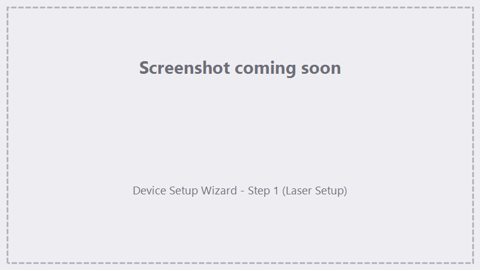

# First-run setup

The first time you launch FocuZ, the **Device Setup Wizard** opens automatically. It also re-opens if you
try to Run or Trace before the device is configured. You can revisit it any time from **Device ▸ Setup
Wizard**.

!!! important "Marking is blocked until the device is configured"
    FocuZ won't let you **Run** or **Trace** until you've imported a `markcfg7` (Step 1). This prevents
    marking with an unconfigured field size / axis mapping.

{ .screenshot }

<!-- TODO screenshot: DeviceSetupWizard step 1 -->

## Step 1 — Laser Setup

> *Select your laser type, then import your markcfg7 to configure the device.*

1. **Laser type** — choose **JCZ Fiber** (the supported type today).
2. Click **Import markcfg7…** and select your machine's `markcfg7` file (the same file EZCad2 uses).
   This loads the **device** settings: field size, field angle, and galvo X/Y axis mapping — and marks the
   device **configured**, which unlocks Run and Trace.
3. The status line confirms **"Device configured (markcfg7 imported)."**

!!! note "What `markcfg7` import sets — and doesn't"
    The wizard imports **device-level** settings only. **Per-lens** correction (the `.cor` file or manual
    values) is configured separately in Step 2.

## Step 2 — Lens Setup

> *Configure the lens you'll mark with. Set its correction (a .cor file or manual values).*

1. Pick the **Lens** you're using (**L1–L8**). FocuZ keeps correction settings **per lens**, so each lens
   has its own field size, scale/angle, and correction.
2. Click **Corrections…** to open the correction dialog and either:
    - **load a `.cor` file** (recommended — the lens map EZCad2/LightBurn use), or
    - enter **manual** correction values (scale, angle, field size, bulge/parallel/trapezoid).
3. *(Later)* set the lens's **focal Z height** on the **Jog ▸ Lens Offset** screen — see
   [Lenses, Corrections & Calibration](../lenses-corrections.md).

See **[Lenses, Corrections & Calibration](../lenses-corrections.md)** for what each correction setting does.

## Step 3 — Done

A summary confirms the device is configured. Click **Finish** to start using FocuZ.

> You can fine-tune lenses any time via the Corrections dialog, and set focal Z heights on the Jog tab.

Next: **[Your first mark](your-first-mark.md)**.
