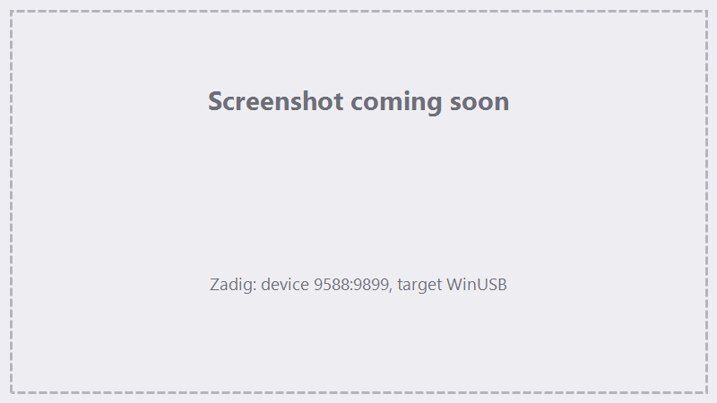

# Installation & driver

## 1. Install FocuZ

1. Download the latest **`FocuZ-<version>-Setup.exe`** from the
   [Releases page](https://github.com/Lokahi-Shop/FocuZ/releases/latest).
2. Run the installer. FocuZ installs **per-user** — **no administrator rights are required**.
3. If the **.NET 8 Desktop Runtime** is missing, the installer offers to install it automatically.
4. Launch **FocuZ** from the Start menu.

!!! note "Versions"
    Releases use calendar versioning — `YY.MM.DD.xx` (e.g. `26.06.06.01`). A plain version number is a
    stable release; builds tagged `-beta` or `-rc` are pre-releases. See
    [Updates & Licensing](../updates-licensing.md).

## 2. Install the BJJCZ USB driver

FocuZ talks to the controller through a **WinUSB** driver. If Windows hasn't already bound a WinUSB
driver to your controller (for example, if this PC has only ever run EZCad2 with its own driver), install
it with the free **Zadig** utility.

!!! info "Do I need this?"
    If FocuZ already lists your device under **Device ▸ Connection**, the driver is fine — skip this step.
    Only install a driver if the controller is plugged in but FocuZ can't see it.

### Using Zadig

1. Download Zadig from **<https://zadig.akeo.ie/>**.
2. Make sure the **BJJCZ controller is connected** via USB.
3. Run Zadig (no admin required).
4. Open the **Options** menu → check **List All Devices**.
5. In the dropdown, select the device with **USB ID `9588:9899`**
   (it may show as *USBLMCV2*, *jczMod2*, or *Unknown Device*).
6. With that device selected (double-check it reads **`9588:9899`**):
    - *(Optional)* edit the name field to `USBLMCV4 (FocuZ)`.
    - Set the target driver to **WinUSB**.
    - Click **Install Driver** and wait for *"Driver installed successfully."*
7. Back in FocuZ, open **Device ▸ Connection** and click **Refresh**.

{ .screenshot }

<!-- TODO screenshot: Zadig window, device 9588:9899 selected, target driver WinUSB -->

!!! warning "Pick the right device"
    Installing a WinUSB driver onto the **wrong** USB device can disable it. Only proceed when the USB ID
    reads exactly **`9588:9899`**.

## 3. Confirm the connection

1. Open **Device ▸ Connection**.
2. Your controller should appear in the device list. Click **Connect**.
3. When connected, FocuZ shows the firmware **version** and **serial number**, and the status indicator
   turns green.

Next: **[First-run setup](first-run.md)**.
