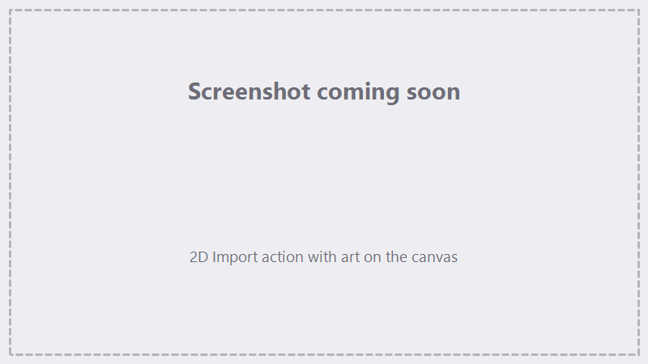

# Your first mark

This walks through a simple 2D mark end to end. It assumes you've
[installed FocuZ + the driver](installation.md) and completed
[first-run setup](first-run.md) (device configured, a lens with correction).

!!! danger "Laser safety"
    Wear rated laser glasses, keep interlocks in place, and **Trace before you Run**. You are responsible
    for safe operation.

## 1. Connect

Open **Device ▸ Connection** and click **Connect**. The status indicator should turn green and show your
controller's version and serial number.

## 2. Add a marking action

FocuZ jobs are an ordered **sequence of actions**. For a first mark you need one marking action:

1. In the **Sequencer**, add an action and choose **2D Import**.
2. Click to **import** a vector file (SVG or DXF). Start with something simple — a small logo or some text
   exported as vectors.
3. The art appears on the **[canvas](../canvas.md)**. Drag to position it, and use the **Position / Size /
   Rotation** controls to place it where the part sits in the work area.

{ .screenshot }

<!-- TODO screenshot: 2D import action, simple art on the canvas -->

!!! tip "Just want to test the beam?"
    Use the **Calibration ▸ Offset** action's quick **Square** / **Circle** buttons to drop a simple test
    shape without importing a file.

## 3. Set marking parameters

Select the action's layer and set its core parameters. Good starting points vary by material and laser —
begin conservative and adjust:

| Parameter | What it does |
|---|---|
| **Speed** (mm/s) | How fast the galvo moves while marking. |
| **Power** (%) | Laser power. |
| **Frequency** (kHz) | Pulse frequency (clamped to your device's min/max). |
| **Q-Pulse** | Pulse width / energy-per-pulse control. |
| **Passes** | How many times to repeat the mark. |

For a filled (engraved) shape, also pick a **fill type** (e.g. bidirectional hatch) and a **hatch
spacing**. To mark just the outline, leave the fill off. See [The Sequencer](../sequencer.md) for all
parameters and fill types.

## 4. Focus the laser

Set the working distance so the beam is in focus on the part — jog **Z** to the lens's focal height (see
**[Jog, Homing & Terminal](../jog-terminal.md)** and the per-lens **Z focal height** in
[Lenses, Corrections & Calibration](../lenses-corrections.md)).

## 5. Trace it (laser off)

Before firing, click **Trace** to run the **red-light preview** — the galvo outlines where the mark will
land with the laser off. Confirm the position and size on the part, then stop the trace.

See [Marking & Tracing](../marking-tracing.md) for the trace modes (Full, Single Layer, Hull, Perimeter,
Area).

## 6. Run

1. Press **Run**.
2. If a homing/lens prompt appears (when the Z axis is enabled but not homed), choose to home + run, or run
   anyway — see [Marking & Tracing](../marking-tracing.md).
3. The **progress bar** shows the current group / layer / pass and an estimated time remaining.
4. **Run** becomes **Pause** while marking — you can pause/resume or cancel.

That's a complete job: *connect → add action → set parameters → focus → trace → run.*

## Next steps

- Save your work as a **`.focuz`** project — see [Projects & Files](../projects-files.md).
- Mark a **3D model** — see [Importing Geometry](../importing.md).
- Learn the full job model — see [The Sequencer](../sequencer.md).
