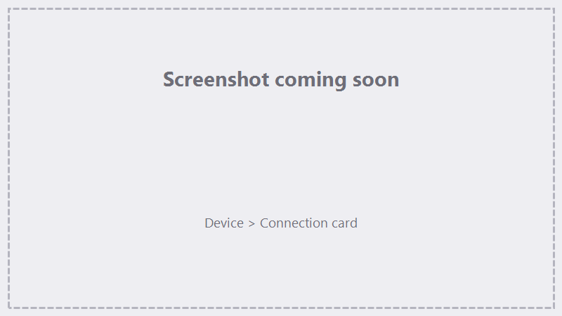
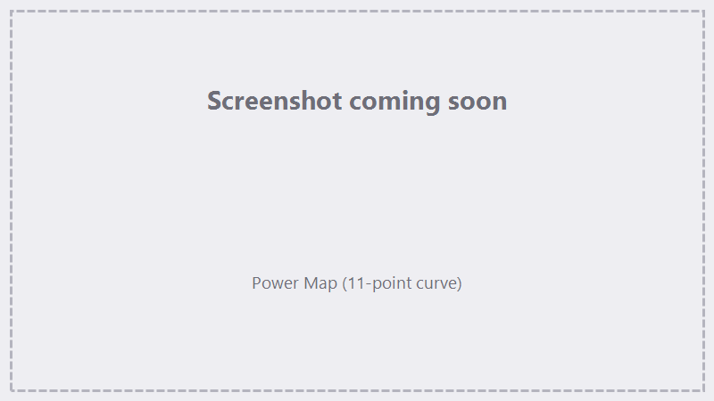

# Hardware & Device Setup

This page covers connecting to the controller and the device-level settings under the **Device** menu. If
you're setting up for the first time, start with [First-run setup](getting-started/first-run.md); this page
is the deeper reference.

!!! note "Device vs. lens settings"
    **Device** settings (here) describe the controller and galvo head — field size, axis mapping, laser
    timing. **Lens** settings (correction, focal Z) are per-lens and live in
    [Lenses, Corrections & Calibration](lenses-corrections.md).

## Connecting (Device ▸ Connection)

{ .screenshot }

<!-- TODO screenshot: Connection overlay card -->

1. Open **Device ▸ Connection**.
2. Pick your controller from the device list and click **Connect**.
3. When connected, FocuZ shows the **firmware version** and **serial number** and a green status
   indicator; the current lens and correction-file status are also shown.
4. **Refresh** re-scans USB. **Install Driver** appears when a controller is plugged in but has no WinUSB
   driver — see [Installation & driver](getting-started/installation.md).

FocuZ can reconnect automatically on startup. The controller must be connected to **Trace** or **Run**.

## Device Setup (Device ▸ Device Setup)

The one-page setup — laser type + `markcfg7` import on top, lens correction below. It's the fastest way
to a working configuration and is covered in
[First-run setup](getting-started/first-run.md). Importing a `markcfg7` is what marks the device
**configured** and unlocks Run/Trace.

!!! note "Fiber lasers"
    FocuZ currently supports **fiber** lasers. When you import a `markcfg7`, FocuZ reads the laser type
    from it and shows it in the device summary. A fiber profile configures the device as usual. A CO2,
    YAG, or SPI profile is **saved**, but marking and tracing stay disabled for that laser type — so you
    can set up and explore, just not mark. Support for more laser types will come as they're verified.

## Laser Setup (Device ▸ Laser Setup)

The full device configuration screen. It includes the same connection controls plus:

### Importing the device profile

- **Import markcfg7** — loads device settings from your machine's `markcfg7` (field size, field angle,
  galvo axis mapping). This is the recommended way to configure the device; manual entry is for fine-tuning.

### Galvo axis assignment

- **Galvo 1 / Galvo 2 → X / Y** — which physical galvo drives which axis. This comes from `markcfg7`; only
  change it if your art marks transposed (rotated/mirrored axes).
- **Mirror** toggles per galvo — flip an axis direction if the mark is mirrored.

!!! tip "If marks come out rotated or mirrored"
    The fix is almost always the galvo X/Y assignment or a mirror toggle here. A re-import of the correct
    `markcfg7` usually sets these for you.

### Laser timing & pulse

- **Open MO delay** — delay after opening the laser's master oscillator before marking.
- **Enable pulse width** — toggles pulse-width control.
- **Delays** — laser on/off, polygon (corner), and end delays; jump speed and ramp settings. Defaults from
  `markcfg7` are a good starting point; tune for mark quality.

### Frequency limits

- **Min / Max frequency (kHz)** — the allowed pulse-frequency range for your laser (1–9999). FocuZ clamps
  per-layer frequency to this range so you can't drive the laser outside spec.

### Path tolerances

- **Curve tolerance (mm)** — how finely curves are approximated into line segments. Smaller = smoother
  curves but more segments.
- **Closed-path tolerance (mm)** — how close endpoints must be for a path to count as closed (affects
  fills).

## Power Map (Device ▸ Power Map)

{ .screenshot }

<!-- TODO screenshot: Power Map 11-point curve -->

A curve that maps **requested power → actual output power** at 0 %, 10 %, … 100 %. Use it to linearize a
laser whose output isn't proportional to the set percentage, or to cap output. **Linear** resets to a 1:1
map; **Reset** restores defaults.

## Rotary

Rotary-axis configuration lives under **Device ▸ Rotary Setup** and is covered in
[Rotary Marking](rotary.md).

## See also

- [Lenses, Corrections & Calibration](lenses-corrections.md) — per-lens field size, correction, focal Z.
- [Jog, Homing & Terminal](jog-terminal.md) — homing and axis control.
- [Troubleshooting & FAQ](troubleshooting.md) — controller-not-found, driver issues.
