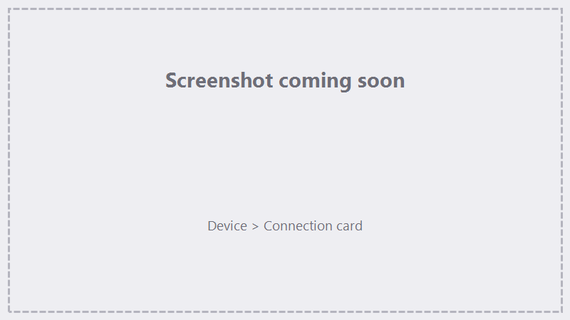
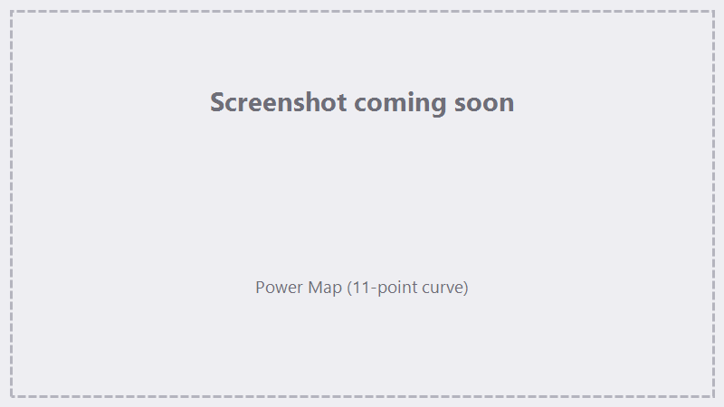

# Hardware & Device Setup

This page covers connecting to the controller and the device-level settings under the **Device** menu. If
you're setting up for the first time, start with [First-run setup](getting-started/first-run.md); this page
is the deeper reference.

!!! note "Device vs. lens settings"
    **Device** settings (here) describe the controller and galvo head — axis mapping, laser timing,
    frequency range. **Lens** settings (field size, correction, focal Z) are per-lens and live in
    [Lenses, Corrections & Calibration](lenses-corrections.md).

## Connecting (Device ▸ Connection)

{ .screenshot }

<!-- TODO screenshot: Connection overlay card -->

1. Open **Device ▸ Connection**.
2. Pick your controller from the device list and click **Connect**.
3. When connected, FocuZ shows the **firmware version** and **serial number** and a green status
   indicator; the current lens and correction-file status are also shown.
4. **Refresh** re-scans USB. **Install Driver** appears when a controller is plugged in but has no WinUSB
   driver — see [Installation & driver](getting-started/installation.md).

FocuZ can reconnect automatically on startup. The controller must be connected to **Trace** or **Run**.

## Device Setup (Device ▸ Device Setup)

The one-page setup — `markcfg7` import on top, lens setup below. It's the fastest way to a working
configuration and is covered in [First-run setup](getting-started/first-run.md). Importing a
`markcfg7` is what marks the device **configured** and unlocks Run/Trace.

Your `markcfg7` lives in EZCad2's **plug** folder. That one import configures **everything device-wide**:
laser settings, rotary axis, red light, power map, and I/O port assignments. If you'd rather bring in
just one of those, each has its own **Import markcfg7** button on its own panel in the **Device** menu.

**Lens settings are always imported separately, per lens** — field size, correction, and work offset
belong to the lens, not the machine, so they're set in [Corrections](lenses-corrections.md) for whichever
lens you're configuring.

!!! note "Two things an import never changes"
    Rotary settings **merge** — only the axis values in the file are applied, so your mode, roller size
    and split defaults survive. And I/O is never switched **on** by an import: assignments come across,
    but you still have to enable I/O yourself, because `markcfg7` files often name a start-marking port.

!!! note "Fiber lasers"
    FocuZ currently supports **fiber** lasers. When you import a `markcfg7`, FocuZ reads the laser type
    from it and shows it in the device summary. A fiber profile configures the device as usual. A CO2,
    YAG, or SPI profile is **saved**, but marking and tracing stay disabled for that laser type — so you
    can set up and explore, just not mark. Support for more laser types will come as they're verified.

## Laser Setup (Device ▸ Laser Setup)

The full device configuration screen, in two sections: **Configuration** (what the machine is) and
**Timing Defaults** (the delay/jump values layers fall back to).

### Configuration

#### Importing the device profile

- **Import markcfg7** — loads device settings from your machine's `markcfg7`: laser type, galvo axis
  mapping, timing defaults, red-light and power-map values. This is the recommended way to configure the
  device; manual entry is for fine-tuning. (Field size, field angle, and the work offset are **per-lens**
  and import separately in the lens Corrections dialog.)
- The import also returns the **path tolerances** (below) to their standard values. If you had tuned
  them, a small **↶** button appears next to each changed tolerance — click it to bring back the value
  you had before the import.

#### Galvo axis assignment

- **Galvo 1 / Galvo 2 → X / Y** — which physical galvo drives which axis. This comes from `markcfg7`; only
  change it if your art marks transposed (rotated/mirrored axes).
- **Mirror** toggles per galvo — flip an axis direction if the mark is mirrored.

!!! tip "If marks come out rotated or mirrored"
    The fix is almost always the galvo X/Y assignment or a mirror toggle here. A re-import of the correct
    `markcfg7` usually sets these for you.

#### Frequency limits

- **Min / Max frequency (kHz)** — the allowed pulse-frequency range for your laser (1–9999). FocuZ clamps
  per-layer frequency to this range so you can't drive the laser outside spec. This is a capability
  range for the machine, which is why it lives in Configuration rather than Timing Defaults.

#### Path tolerances

- **Curve tolerance (mm)** — how far a curve is allowed to deviate from the line segments that
  approximate it. Smaller = smoother curves but more segments. It's measured at the artwork's **final
  size**, so resizing art doesn't change how smooth it marks. The default (0.01 mm) is well below a
  typical beam width; loosening it produces fewer points and faster marking.
- **Closed-path tolerance (mm)** — how close endpoints must be for a path to count as closed (affects
  fills).

#### Fiber pulse settings

- **Open MO delay** — delay after opening the laser's master oscillator before marking.
- **Enable pulse width** — toggles pulse-width control (MOPA on, non-MOPA off).
- **Laser leak handle** — closes the master oscillator between jobs on lasers that need it.

### Timing Defaults

The device-wide **delay** (laser on/off, end, polygon corner) and **jump** (speed, min, max, limit)
values. Every layer whose Timing Mode is **Device** uses these at mark time; layers with **Custom**
timing override them per layer (see [Timings](sequencer.md#timings)). Values from a `markcfg7` import
are a good starting point; tune for mark quality.

## Power Map (Device ▸ Power Map)

{ .screenshot }

<!-- TODO screenshot: Power Map 11-point curve -->

A curve that maps **requested power → actual output power** at 0 %, 10 %, … 100 %. Use it to linearize a
laser whose output isn't proportional to the set percentage, or to cap output. **Linear** resets to a 1:1
map; **Reset** restores defaults.

## Digital I/O (Device ▸ BJJCZ IO)

If your machine has external wiring — a start footswitch, a door interlock, a stack light, a PLC —
this is where you tell FocuZ which controller port each signal uses. Ports are numbered **0–15**, and
**NULL** means "not connected". Each signal also has a **HIGH / LOW** button setting the level at
which it counts as active.

Nothing here takes effect until you tick **Enable I/O** and press **Save**, so a machine with no
external wiring is unaffected. **Import markcfg7** copies the assignments out of an existing EZCad2
configuration.

**Outputs** FocuZ drives:

- **Marking IO** — active while a job is marking (released as soon as it finishes).
- **Red Light Pointer** — active while the red pointer or a trace is running.
- **Laser Ready / Laser Power** — reserved for machines that expect those lines.

**Inputs** FocuZ watches, each with its own behavior:

- **Start Mark** — starts the sequence. With **Pulse Mode** ticked, one press runs one job; unticked,
  it keeps re-running while the signal is held. Releasing never cancels a job in progress.
- **Laser Ready** — checked once, when a job starts. If the laser isn't ready the run is blocked with
  a message; it is not re-checked while marking.
- **Door** and the **Stop Mark** bits (0–7) — watched **while marking only**. If one trips, the job
  stops immediately and shows the message you set for it. A stopped job does not resume — restarting
  marks from the beginning.

!!! warning "A held signal never starts a job on its own"
    FocuZ only starts on a *change* from inactive to active. If a start input is already active when
    FocuZ launches or reconnects — a stuck switch, for example — nothing happens until it is released
    and pressed again. Outputs are also driven back to their idle state when a run ends and when
    FocuZ closes, so nothing is left switched on.

## Rotary

Rotary-axis configuration lives under **Device ▸ Rotary Setup** and is covered in
[Rotary Marking](rotary.md).

## See also

- [Lenses, Corrections & Calibration](lenses-corrections.md) — per-lens field size, correction, focal Z.
- [Jog, Homing & Terminal](jog-terminal.md) — homing and axis control.
- [Troubleshooting & FAQ](troubleshooting.md) — controller-not-found, driver issues.
