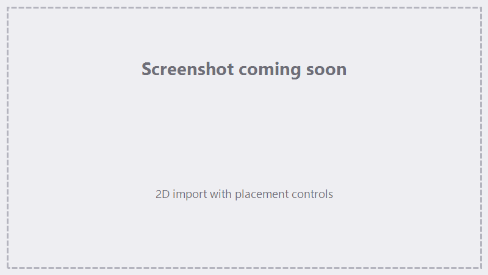

# Importing Geometry

FocuZ imports both 2D art and full 3D models. 3D models are sliced into layers for depth-aware marking.

## Supported formats

| Kind | Formats | Notes |
|---|---|---|
| 2D vector | **SVG, DXF, AI** | Lines/curves to mark or fill. |
| 3D solid | **STEP / STP** | True solids (via the built-in 3D engine). |
| 3D mesh | **STL, OBJ, 3MF** | Triangle meshes. |
| Images | common raster formats | For reference/placement. |

## Importing 2D art

Add a **2D Import** action (or drag a file onto the canvas) and choose your file.

- **Multi-layer files** — if the file has multiple layers, FocuZ asks whether to **flatten** them into one
  or keep them **separate**.
- **Registration point** — choose the reference point used to position the art (a 9-point grid for 2D).
- **Position / Size / Rotation** — place and scale the art on the [canvas](canvas.md); link or unlink X/Y
  scaling.
- **Border** — optionally load a closed path as a **clipping boundary** so marks stay within it.

{ .screenshot }

<!-- TODO screenshot: 2D import + placement -->

!!! tip "Fills need closed paths"
    A [fill](sequencer.md#fill-types) can only fill a **closed** shape. If a fill looks empty, the path
    probably isn't closed — check it in your design tool, or adjust the closed-path tolerance in
    [Hardware & Device Setup](hardware-setup.md).

## Importing 3D models (slicing)

Add a **3D Slice** action and import a STEP/STP or mesh file. FocuZ switches to the 3D canvas and slices the
model into layers for marking.

- **Registration** — position the model in the work area (a 27-point grid for 3D).
- **Sizing & Z position** — scale the model and set where it sits along Z.
- **Fill-Through** — whether the bottom slice is marked.
- The **slice count** follows the model's depth and your settings.

How slices are marked (Z order, per-slice sublayers) is covered in
[Marking & Tracing](marking-tracing.md#3d-slice-marking).

## Tips

- Check **units/scale** on import — confirm the imported size on the canvas grid before marking.
- Re-importing the same file is supported; FocuZ can relink originals when you reopen a project (see
  [Projects & Files](projects-files.md)).

## See also

- [The Canvas](canvas.md) — placing and transforming imports.
- [The Sequencer](sequencer.md) — fills and marking parameters.
- [Marking & Tracing](marking-tracing.md) — running a 2D or 3D job.
