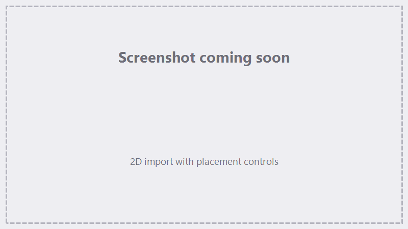

# Importing Geometry

FocuZ imports both 2D art and full 3D models. 3D models are sliced into layers for depth-aware marking.

## Supported formats

| Kind | Formats | Notes |
|---|---|---|
| 2D vector | **SVG, DXF, AI** | Lines/curves to mark or fill. |
| 3D solid | **STEP / STP** | True solids (via the built-in 3D engine). |
| 3D mesh | **STL, OBJ, 3MF** | Triangle meshes. |
| Images | common raster formats | For reference/placement. |

## Importing 2D art

Add a **2D Import** action (or drag a file onto the canvas) and choose your file.

- **Multi-layer files** — if the file has multiple layers, FocuZ asks whether to **flatten** them into one
  or keep them **separate**.
- **Registration point** — choose the reference point used to position the art (a 9-point grid for 2D).
- **Position / Size / Rotation** — place and scale the art on the [canvas](canvas.md); link or unlink X/Y
  scaling.
- **Border** — optionally load a closed path as a **clipping boundary** so marks stay within it.

{ .screenshot }

<!-- TODO screenshot: 2D import + placement -->

!!! tip "Fills need closed paths"
    A [fill](sequencer.md#fill-types) can only fill a **closed** shape. If a fill looks empty, the path
    probably isn't closed — check it in your design tool, or adjust the closed-path tolerance in
    [Hardware & Device Setup](hardware-setup.md).

## Preparing AI and SVG files

A little preparation in your design tool makes vector imports land exactly as designed.

### Convert text to outlines

**FocuZ imports vector paths, not fonts.** Live text in an AI or SVG file — text still bound to a
font — is not imported, and there are no plans to render fonts inside FocuZ: substituting an
installed font for the designer's font would mark the *wrong* shapes with full confidence, which
is worse than leaving them out. Convert text to paths before exporting:

- **Illustrator:** select the text → **Type ▸ Create Outlines** (Ctrl/Cmd+Shift+O).
- **Inkscape:** select the text → **Path ▸ Object to Path**.

If imported art is missing its lettering, this is almost always why.

### Flatten before export

Flattening (Illustrator: **Object ▸ Flatten Transparency**, or **Object ▸ Expand / Expand
Appearance**) bakes advanced constructs down to plain paths — which is exactly what a laser
needs:

- **Clipping masks** are applied: geometry is genuinely cropped to the mask, so hidden portions
  can't come back on import.
- **Symbols, brushes, patterns and effects** become real geometry at their placed positions.

Files saved as **Illustrator 8** (the version EZCad2 requires) are largely flattened by the
save-down itself, which is why EZCad2-era art usually imports cleanly.

### Artboards

FocuZ imports the **artboard's art**: paths entirely outside the artboard are skipped, and the
count is recorded in the log ("*N paths beyond the artboard were not imported*") so a missing
element is never a mystery. Artists commonly park scratch material on the pasteboard — that
material stays out of your job.

- Art **crossing** the artboard edge imports whole by default. The Preferences ▸ Import option
  **"clip art crossing the artboard closed at its edge"** cuts it at the boundary instead,
  resealing closed shapes along the edge (note the sealed edge marks as a line).
- A file with **several artboards** asks which one to import.
- A file with no artboard declaration imports in full.

### Sizes and units

AI files import at true size (Illustrator's points convert to millimeters). SVG files with real
units (mm/cm/in/pt) import exactly; pixel-based SVGs use **Preferences ▸ Import ▸ SVG px
scale** — *Auto* reads 96 dpi (the web standard) unless the file identifies itself as an
Illustrator export (72 dpi), or force either value.

!!! tip "Hidden layers stay hidden"
    Layers or objects hidden in the file (`display: none` / hidden visibility in SVG) are not
    imported — a layer you switched off in your design tool can't silently mark the part.

## Importing 3D models (slicing)

Add a **3D Slice** action and import a STEP/STP or mesh file. FocuZ switches to the 3D canvas and slices the
model into layers for marking.

- **Registration** — position the model in the work area (a 27-point grid for 3D).
- **Sizing & Z position** — scale the model and set where it sits along Z (for rotated models see
  [Rotating 3D models](canvas.md#rotating-3d-models)).
- **Perimeter** — an optional boundary around the model's footprint (Import / Hull / Circle / Square) —
  see [3D perimeters](sequencer.md#3d-layers-the-perimeter).
- **Fill-Through** — whether the bottom slice is marked.
- The **slice count** follows the model's depth and your settings.

!!! note "Open meshes"
    STL/OBJ/3MF meshes are checked on import, and FocuZ tells you if a mesh isn't closed ("watertight").
    An open mesh can slice unpredictably — repair it in your modeling tool, or use **STEP** for true
    solids (always closed).

How slices are marked (Z order, per-slice sublayers) is covered in
[Marking & Tracing](marking-tracing.md#3d-slice-marking).

## Tips

- Check **units/scale** on import — confirm the imported size on the canvas grid before marking.
- Re-importing the same file is supported; FocuZ can relink originals when you reopen a project (see
  [Projects & Files](projects-files.md)).

## See also

- [The Canvas](canvas.md) — placing and transforming imports.
- [The Sequencer](sequencer.md) — fills and marking parameters.
- [Marking & Tracing](marking-tracing.md) — running a 2D or 3D job.
