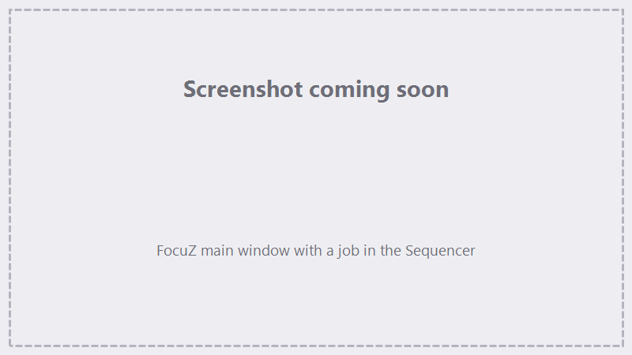

# FocuZ

**FocuZ** is a Windows laser-control suite for **BJJCZ galvo controllers** — the same fiber-laser
controllers used by EZCad2 and LightBurn. Import 2D and 3D art, lay it out, slice it, and drive your
fiber laser with full control over fills, marking order, registration, and per-layer parameters.

{ .screenshot }

<!-- TODO screenshot: main window — empty/representative job loaded, Sequencer visible -->

[Get started →](getting-started/index.md){ .md-button .md-button--primary }
[Buy FocuZ](https://lokahi.shop){ .md-button }

## What makes FocuZ different

- **3D marking from STL and STEP models.** Import a real 3D model, register it in the work area, and
  FocuZ slices it into layers and marks each one — depth-aware engraving, not just flat art. Most galvo
  software is 2D-only.
- **Runs your existing BJJCZ controller.** FocuZ talks directly to BJJCZ/JCZ fiber controllers — the
  same hardware EZCad2 and LightBurn drive — so there's no new control board to buy. It even imports your
  existing `markcfg7` device profile and `.cor` correction files.
- **An integrated motion + accessory controller.** Alongside the galvo controller, FocuZ pairs with a
  **FocuZ:grbl** controller (a custom GRBL build) that drives **X / Y / Z axis motion** (jogging, homing)
  *and* **accessory relays** — switch **air assist**, a **vacuum**, or other peripherals on and off, either
  by hand or automatically as steps in a job. See [Jog, Homing & Terminal](jog-terminal.md).
- **A sequencer, not just a pen list.** Jobs are built as an ordered **sequence of actions** with
  repeats, per-slice steps, and grouping (see below) — a more powerful model for multi-step and 3D jobs.
- **Rich fills and per-layer control.** Line fills (unidirectional, bidirectional, cross), Hilbert, snake, contour, and thatch fills;
  per-layer speed/power/frequency/Q-pulse/passes; variation sweeps; and offset "cut" passes.

## How FocuZ works

If you're coming from EZCad2 or LightBurn, the biggest difference is the **mental model**.

Traditional galvo software uses an **object / pen** model: you place objects on a page and assign each
one a "pen" or layer that carries its settings. The laser marks the objects.

**FocuZ runs a _sequence of actions_.** You build a job in the **Sequencer** as an ordered list of steps,
and FocuZ executes them top to bottom when you press **Run**. Each step is an *action* — for example:

- **mark imported 2D art**,
- **slice and mark a 3D model**,
- **jog an axis**, **switch a relay** (air assist, vacuum), **pause**, **run a G-code command**, and more.

That ordered-sequence model is what unlocks FocuZ's more advanced behavior:

- **Repeats** — an action (or a whole group) can run multiple times.
- **Run-every-Nth** — sub-steps can fire on every Nth pass or 3D slice (e.g. clean or index between
  passes), instead of every time.
- **Groups & layers** — actions are organized into groups, layers, and sublayers you can enable and
  repeat independently.

So in FocuZ you're describing *what the machine does, in order* — not just *what art exists on a page*.
The [Sequencer](sequencer.md) and [Marking & Tracing](marking-tracing.md) sections cover this in depth.

!!! tip "New to FocuZ?"
    Start with **[Getting Started](getting-started/index.md)** — it walks you from install and driver
    setup through your first mark.

## Who it's for

Fiber-laser owners running a BJJCZ/JCZ galvo controller who want 3D model marking, a flexible job
sequencer, and direct control of their existing hardware on Windows.

## Where to go next

| If you want to… | Go to |
|---|---|
| Install FocuZ and make a first mark | [Getting Started](getting-started/index.md) |
| Connect and configure the controller | [Hardware & Device Setup](hardware-setup.md) |
| Set up lenses and correction | [Lenses, Corrections & Calibration](lenses-corrections.md) |
| Bring in SVG/DXF/STEP/STL art | [Importing Geometry](importing.md) |
| Build and run a job | [The Sequencer](sequencer.md) · [Marking & Tracing](marking-tracing.md) |
| Fix a problem | [Troubleshooting & FAQ](troubleshooting.md) |

---

FocuZ is a commercial product by **[Lokahi Innovation](https://lokahi.shop)**. Need help? See
[Support](support.md).
