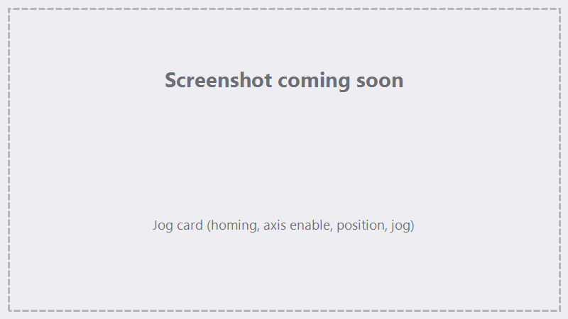
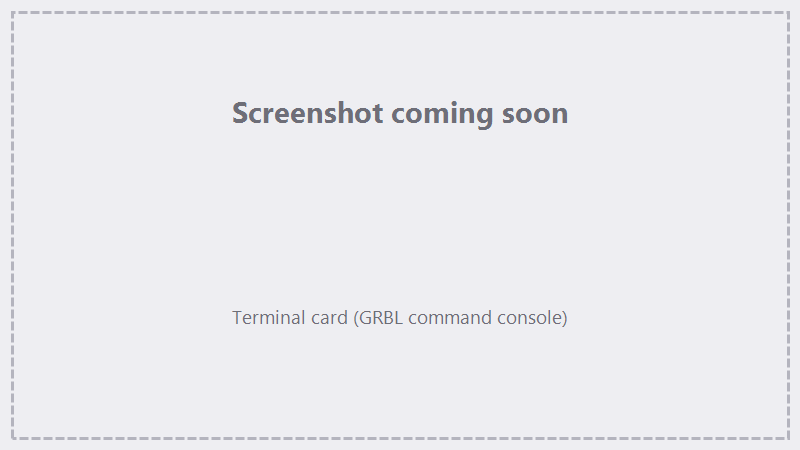

# Jog, Homing & Terminal

This section covers the **FocuZ:grbl controller** — the motion-and-accessory controller FocuZ pairs with
your galvo controller — and the **Jog** and **Terminal** screens that drive it.

## The FocuZ:grbl controller

FocuZ uses **two** controllers that work together:

- the **galvo controller** (BJJCZ) steers the laser beam and fires it (see
  [Hardware & Device Setup](hardware-setup.md)), and
- the **FocuZ:grbl controller** — a custom GRBL build — moves the **X / Y / Z axes** (stage, gantry, or
  Z focus) and switches **accessory relays**.

FocuZ detects the FocuZ:grbl controller automatically when it connects (it identifies itself on the wire),
so the homing, jogging, and accessory features described here light up once it's connected.

!!! note "Two controllers, one job"
    The galvo marks; the FocuZ:grbl controller handles motion and accessories. A job can interleave both —
    for example, jog an axis, switch on air assist, mark, then switch it off. How they coordinate within a
    run is covered in [Marking & Tracing](marking-tracing.md).

## Jog

Open **Jog** from the menu. The Jog card gives you homing, axis control, and live position.

{ .screenshot }

<!-- TODO screenshot: Jog overlay card -->

### Homing

- **Home X / Home Y / Home Z** home each axis independently; **Home All** runs them in sequence.
- Each axis tracks its own **homing status**. An axis must be homed for its absolute position to be
  trustworthy; homing is what establishes a known origin (by touching the limit switch).
- After an **alarm** (e.g. a limit hit) an axis loses its homed status and must be re-homed before its
  position is trusted again — see [Troubleshooting & FAQ](troubleshooting.md).

### Axis Enable

Each axis has an **Enable** checkbox. Enabling an axis includes it in operations that need confident
absolute positioning. Whether a run requires a given axis to be homed depends on which axes are enabled and
what the job does.

### Position & limits

- **MPos** is the machine (absolute) position; **LPos** is the work position FocuZ derives from it.
- Limit-switch status is shown per axis/direction so you can confirm switches before homing.

### Manual jogging

- Set a **jog distance** (step size) and **jog speed**, then use the per-axis jog buttons to move by that
  step. Arrow-key **nudge** gives finer control.
- **Home & Jog to Lens 0** homes Z and moves to the active lens's saved focal height in one step — handy
  for getting straight to focus (see [Lenses, Corrections & Calibration](lenses-corrections.md)).

!!! warning "How jogging really behaves (open-loop)"
    The FocuZ:grbl controller is **open-loop** and **queues** moves:

    - Clicking a jog button several times runs the jogs **one after another** — each click queues another move.
    - A move is "done" when the controller reports **Idle**, not when the axis is *confirmed* to have
      physically arrived. With no encoder, a stall, a disabled driver, or missed steps are **not** detected.
    - Positional confidence comes from **homing** (hitting the limit switch), not from per-move confirmation.

## Terminal

Open **Terminal** to talk to the FocuZ:grbl controller directly. Type a command, press Enter (or Send), and
the output window shows what you sent (`> …`) and the controller's replies. Use it to run G-code, check
status, or switch accessory outputs (below).

{ .screenshot }

<!-- TODO screenshot: Terminal overlay card -->

## Accessory relays — air, vacuum & more

The FocuZ:grbl controller has several **auxiliary relay outputs** (switched 24 V / 5 V) you can wire to
peripherals — most commonly **air assist** and a **vacuum / extraction** fan, but any on/off accessory works.

Each output is switched with an **M-code**. You can send these:

- **manually**, by typing the M-code in the **Terminal**, or
- **as a job step**, with a **GRBL - Command** action in the [Sequencer](sequencer.md) — e.g. turn air on
  before a marking action and off after it, so it's automatic every run.

!!! example "Air assist around a mark (in a job)"
    1. **GRBL - Command** — switch the air-assist output **on**.
    2. **2D Import** (or **3D Slice**) — the marking action.
    3. **GRBL - Command** — switch the output **off**.

!!! warning "Confirm the codes for your wiring"
    Which M-code maps to which physical output (and therefore to air vs. vacuum) depends on how your
    controller is wired and configured. Test each output from the **Terminal** and label them before relying
    on them in a job. *(Exact output-code table to be documented for the standard FocuZ:grbl build.)*

## See also

- [Hardware & Device Setup](hardware-setup.md) — the galvo controller side.
- [The Sequencer](sequencer.md) — GRBL - Jog / GRBL - Command job steps.
- [Marking & Tracing](marking-tracing.md) — how motion + marking coordinate in a run.
- [Troubleshooting & FAQ](troubleshooting.md) — alarms, re-homing, connection.
