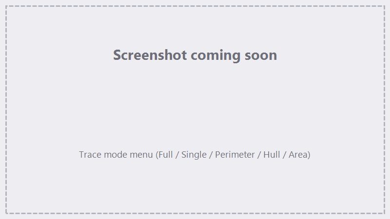
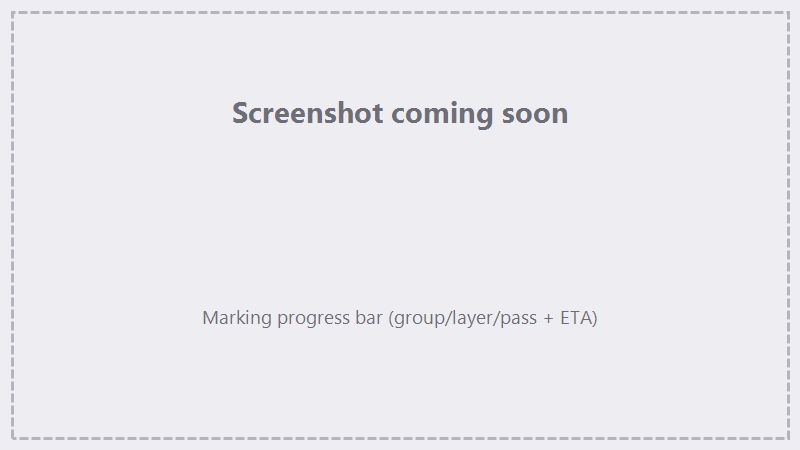

# Marking & Tracing

How to preview a job with the red-light **Trace** and run it with the laser.

!!! danger "Laser safety"
    Wear rated laser glasses, keep interlocks in place, and **Trace before you Run**. You are responsible
    for safe operation.

## Trace (red-light preview)

**Trace** runs the job's motion with the **laser off**, using the red guide beam so you can confirm
placement and size on the part before firing. Pick a mode from the Trace dropdown:

| Mode | Previews |
|---|---|
| **Full** | The whole job, step by step. |
| **Single Layer** | Just the selected layer. |
| **Perimeter** | The outline of the marked area. |
| **Hull** | The convex hull (outer boundary) of the marked area. |
| **Area** | A filled sweep of the marked area's extents. |

Start Trace, confirm on the part, then stop it. Trace needs the controller connected.

{ .screenshot }

<!-- TODO screenshot: Trace mode menu -->

## Running a job

Press **Run** to execute the sequence top to bottom. While running, **Run** becomes **Pause** — you can
**Pause / Resume** or **Cancel**.

- **Device must be configured** (a `markcfg7` imported) or Run is blocked — see
  [First-run setup](getting-started/first-run.md).
- If an axis that needs homing isn't homed, a prompt offers to **home + run** or **run anyway** (see below).

### Galvo + FocuZ:grbl coordination

A job can mix galvo marking with [FocuZ:grbl](jog-terminal.md) motion and accessory steps — for example:
jog an axis into place, switch on **air assist**, mark, then switch it off. FocuZ runs these in order and
waits for each motion step to finish before the next action. Jobs that use GRBL steps need the FocuZ:grbl
controller connected.

!!! note "Open-loop motion"
    Motion "completes" when the controller reports Idle, not when the axis is confirmed to have physically
    arrived — see the [open-loop note](jog-terminal.md#manual-jogging). Homing is what gives position
    confidence.

### Lens activation & homing gate

If the Z axis is enabled but not homed when you Run, FocuZ shows a prompt to **home + jog + run** or
**run anyway**. This protects against marking out of focus on an un-referenced Z. See
[Lenses, Corrections & Calibration](lenses-corrections.md).

## Progress

While marking, a **progress bar** shows where you are — a breadcrumb of group / layer / sublayer / pass —
plus a percentage and an estimated **time remaining**.

{ .screenshot }

<!-- TODO screenshot: progress bar mid-run -->

## 3D slice marking

A **3D Slice** action marks a model layer by layer:

- Slices run **top to bottom** by default; check **Inverse** to mark bottom-up, starting at the floor.
- Sublayers (jog, accessory, etc.) can fire on every slice or every Nth slice (Run-every-N).
- **Fill-Through** controls whether the bottom slice is marked. With a hole-respecting **Hull**
  perimeter (see [3D perimeters](sequencer.md#3d-layers-the-perimeter)), the model's through-holes are
  marked at full depth.
- **Z+ Offset** adds extra depth, entered in **mm** or **slices** (pick the unit next to the value):
    - **With a perimeter**, the slice stack shifts up so the background around the model carves deeper.
    - **Without a perimeter**, the base (floor) slice is marked that many extra times — paired with a
      **Jog** sublayer, each extra pass steps the axis on, driving the profile deeper into the material.

See [Importing Geometry](importing.md) for setting up a 3D job.

## Run isolation

While a job runs, FocuZ locks the things that could disrupt it — the lens selector and per-axis Enable are
disabled, destructive File actions are blocked, and Trace is unavailable. The engine works from a snapshot
taken when you pressed Run, so edits you make during a run apply to the **next** run, not the current one.

## See also

- [The Sequencer](sequencer.md) — building the job.
- [Jog, Homing & Terminal](jog-terminal.md) — motion + accessory relays.
- [Lenses, Corrections & Calibration](lenses-corrections.md) — focus and alignment.
