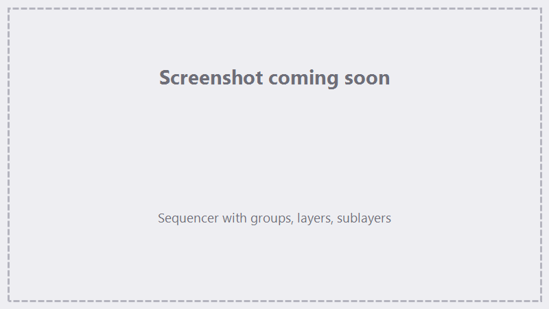

# Rotary Marking

Mark cylindrical parts — tumblers, rings, shafts, pens — by rotating the part between marking
passes. The galvo can only mark a flat window at a time, so FocuZ wraps your artwork around the
part in **splits**: it marks one strip, rotates the part, marks the next strip, and so on until
the whole design is on the surface.

Rotary marking always runs through the [**2D Rotary** action](#the-2d-rotary-action) in the
Sequencer — the action carries the job's part and split values, so nothing has to be switched
on or off app-wide. The rotary hardware itself (motor, mode, axis) is configured once under
**Device ▸ Rotary Setup**.

{ .screenshot }

## Rotary Setup

### Settings

- **Invert Direction** — flip the rotation direction for both jogging and marking.
- **Return to 0** — rotate back to the zero position when the job finishes (on by default).
  If a run is interrupted — cancelled or stopped for any reason — FocuZ always returns the
  rotary to zero so the part is never left at an arbitrary angle.
- **Mode** — **Chuck** grips the part and turns it directly; **Roller** turns the part by
  spinning drive rollers underneath it (see [Chuck vs. Roller](#chuck-vs-roller)).
- **Axis** — the axis the part **rotates around**. The artwork wraps *around* that axis: with
  X selected, the art's vertical (Y) direction wraps around the part; with Y selected, the
  art's horizontal (X) direction wraps. Match it to how the rotary sits under the laser.
- **Gear Ratio** — the drive ratio between motor and part, as *n* : 1. At 1 : 1 the motor's
  Steps/Rot is the part's steps per rotation; a 2 : 1 reduction means the motor turns twice
  per part rotation.
- **Roller Ø** — in Roller mode, the drive rollers' diameter. Surface travel follows the
  roller, so both diameters matter: the part diameter for wrapping the artwork, the roller
  diameter for the motion math.

### Default Values

- **Diameter (default)** — a *default* part diameter for new 2D Rotary actions. Leave it blank
  if every job is a different part — each action carries its own diameter either way.
- **Size (default)** — a *default* strip width for new 2D Rotary actions, in mm of part
  surface. Smaller splits stay closer to the laser's focus and the field's sweet spot; larger
  splits mean fewer seams and faster jobs. Keep the strip shallow enough that its edges are
  still within your focus tolerance.
- **Overlap (default)** — a *default* overlap between neighboring strips, in mm. A little
  overlap can hide seam lines in fills.

The three defaults only pre-fill a new 2D Rotary action's fields; a blank default leaves the
action's field blank until you enter it there.

### Rotary Behavior
- **Overlap fills only (outlines marked once)** — with an overlap set, fills keep the overlap
  but outlines are trimmed to the exact seam, so outline strokes are never double-marked. Use
  this when overlap helps your fills but doubles up your outlines.
- **Seam-aware splits (seams avoid geometry)** — lets each seam shift a little (up to about a
  quarter of the split size) to land in the widest nearby gap in the artwork, so seams fall
  *between* letters and shapes instead of through them. The **Gap** field beside it sets the
  narrowest empty band that counts as a seam home (default 0.1 mm) — lower it to let seams use
  very fine gaps, such as the grid lines of a checkerboard pattern.
- **Arc compensation (correct curvature per split)** — the laser projects each strip onto a
  flat plane, but the part surface curves away from it, so marks land slightly stretched near
  the strip edges. Arc compensation pre-corrects for the curvature so design distances land as
  true on-surface distances. The effect grows quickly with split size — it's what keeps
  geometry true when you use large splits, and it lets you size splits by focus alone.
- **Backlash compensation (lash taken up before the first split)** — off by default. When on,
  the rotary overshoots the first strip slightly and comes back onto the position from the
  marking direction, so the first strip is approached from the same side as every later advance
  and gear or chuck play can't land in the first seam. Turn it on for geared or chuck drives
  with measurable play.

Splits are always distributed evenly across the artwork, so the last strip is the same size as
the rest — no thin leftover strip at the end.

## Multi-pass rotary jobs: Per lap

A layer set to more than one **pass** shows a **Per lap** checkbox in its header, next to Repeat.
It decides the *order* those passes run in — the number of marks is the same either way.

- **Per lap ticked (default)** — one pass on every split, then back to zero and round again. Each
  strip gets a full revolution to cool before its next pass, and seam artifacts are spread across
  the job rather than concentrated. This is how most laser software sequences a rotary job, and it
  generally gives the better mark.
- **Per lap unticked** — all of a split's passes run back to back before the rotary advances, so
  each strip is taken to depth in one go. Fewer rotary moves, so the job finishes sooner.

With 5 passes over 4 splits, ticked runs 5 laps of 4 splits; unticked marks split 1 five times,
then split 2 five times, and so on. Backlash is taken up again at the start of **every** lap, so
each lap's first strip is entered from the marking side just like the job's first strip.

**Sublayers follow their parent layer** — they have no checkbox of their own, so a layer and its
sublayers can't disagree about lap order. **Group repeat** always stays inside the strip.

The box is hidden at 1 pass, where there's nothing to order.

!!! tip "Repeating the whole rotation as a job step"
    Per lap repeats a *layer*. To repeat the entire 2D Rotary action, loop it with a
    [Goto](sequencer.md#action-types) — each time round it re-plans and takes up backlash again,
    and whether it returns to zero between rounds is up to **Return to 0** in Settings.

### Motor

- **Steps/Rot** — motor steps per motor rotation (combine with Gear Ratio for the part).
- **Ramp Min / Max Speed** — each rotation ramps from Ramp Min up to Max Speed, in
  pulses/sec. Ramp Min is the starting speed, not a limit — a heavy chuck or part may need a
  lower one to start smoothly without losing steps; a light setup can start faster.
- **Accel** — acceleration ramp time, in ms.
- **Return Spd** — speed used when returning to zero.

### Jogging the rotary

Live rotary motion lives on the **Jog** card's **BJJCZ Rotary** strip (available while the
controller is connected): jog **CCW / CW** by the set angle, **Set Zero** to define the current
position as zero, and **Go to Zero** to rotate back to it at the Return Spd — with a live
position readout. See [Jog, Homing & Terminal](jog-terminal.md).

**Import Rotary from markcfg7…** pulls rotary parameters from an existing `markcfg7` file, the
same way as the main [device import](hardware-setup.md). The Device Setup window
([first-run setup](getting-started/first-run.md)) offers the same import in its Rotary Setup
section — including reusing the device's own `markcfg7` — so a rotary can be configured during
first run.

## The 2D Rotary action

The **2D Rotary** action (in the Sequencer's Marking group) is a 2D Import that marks through
the rotary engine — it's the one and only way a job runs on the rotary. It carries its own
**Rotary** section above its content:

- **Part Diameter / Split Size / Overlap** — the job's own values, saved with the project and
  set **once for the whole action** in the Rotary section that sits above the layers: one part
  per action, shared by everything the action marks. Values pre-fill from the Rotary Setup
  defaults when the action is created; fields with no default start blank. **All three are
  required** — the run and trace are blocked, with a message naming the missing field, until
  they're entered (an overlap of 0 counts as entered). Different actions (or different
  projects) can target different parts without touching the device setup.
- **Start Offset** — optional, in part degrees: rotates the whole job's starting orientation
  on the part without changing the rotary's Set Zero position. Handy for marking at a specific
  clock position, or spacing repeat jobs around the same part. 0 (or blank) = none; Return to
  0 still returns to the true zero.

Axis, mode, motor settings, and the split-quality options still come from Rotary Setup — the
action carries only the job values. Because rotary is per-action, nothing is left switched on
afterward — other actions and later jobs are unaffected.

## Placing more than one piece of art

Position along the wrap direction is **absolute**: where art sits on the canvas is where it
lands on the part, measured around the circumference from the rotary's zero position. Moving a
piece of art along the wrap axis moves it *around the part*; moving it along the other axis
moves it along the part's length. That means two pieces of art always land in the same places
on the part no matter how you organize them — but *how* they mark differs:

| | Same layer | Two layers, one action | Two 2D Rotary actions |
|---|---|---|---|
| **Revolutions** | One | One — all of an action's layers share the same part values, so they share the revolution | Two — each action runs all of its splits before the next begins |
| **Splits & seams** | One split plan across the combined artwork | Same combined plan — seams line up for both pieces | Each action plans around its own artwork — seams fall in different places |
| **Position on the part** | Absolute — identical in all three arrangements | Same | Same |
| **Where filled shapes overlap** | Overlapping areas cancel to unfilled (with the default Even / Odd fill grouping) | Each layer fills independently — the overlap is **marked twice** | Marked twice |
| **Where outlines overlap** | Both mark, on top of each other | Same | Same |
| **Marking settings** | One set shared by everything in the layer | Independent per layer | Independent per layer |
| **Marking order** | All content together, split by split | Layer order *within* each split, then the part rotates | The first action completes entirely, then the second runs |
| **Fit circumference** | Fits the combined width of all the layer's art | Fits each layer's own art | Fits each layer's own art |

!!! tip "Which arrangement to use"
    Use the **same layer** when the pieces share settings and you want one revolution.
    Use **separate layers** for per-piece settings while keeping one revolution and aligned
    seams. Use **separate actions** only when the jobs must be sequenced independently — for
    example with a jog or an operator prompt between them — at the cost of a second revolution
    and seams that don't line up between the two.

Nothing warns about overlap: overlapping art simply marks as the table describes, and art
placed more than a full circumference apart wraps onto whatever already occupies that angle.
The preview shows the true result either way.

## Previewing splits

In the [Preview](marking-tracing.md) of a 2D Rotary action, a vertical **split slider** appears
beside the playback slider, with one stop per split:

- By default the preview shows **one split at a time**, centered in the canvas — exactly the
  strip the galvo will see. Move the slider to step through the splits.
- The horizontal playback slider and the split slider follow each other: scrubbing playback
  advances the split; picking a split jumps playback to that split's beginning.
- The **All** button shows every split at once at its true position instead.

Seam-aware splits and arc compensation show up in the preview exactly as they will mark.

## Sublayers in rotary jobs

Sublayers run inside each split, just as they do in flat marking — jog sublayers fire between
passes, and **Groove** sublayers (the rotary name for the Cut mode) mark their offset bands
clipped to the current strip. A groove is for grooving and deep engraving around the part — it
is sectioned by splits like all rotary content, and is not a tube through-cutting mode.

## Chuck vs. Roller

- **Chuck** — the part is gripped and rotated directly. One motor rotation (through the gear
  ratio) is one part rotation, regardless of part size.
- **Roller** — the part rests on powered rollers. The rollers move the *surface*, so surface
  travel depends on the roller diameter, and how far the part turns depends on both diameters.
  Enter the part diameter and the roller diameter and FocuZ handles the conversion.

## See also

- [Hardware & Device Setup](hardware-setup.md) · [The Sequencer](sequencer.md) ·
  [Marking & Tracing](marking-tracing.md)
