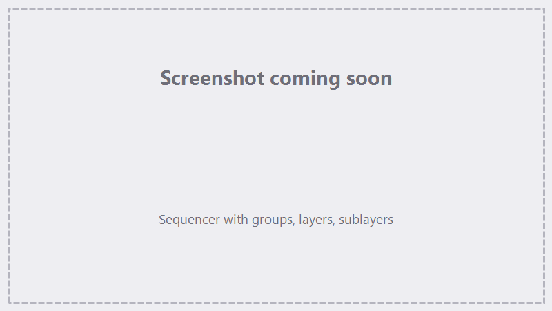

# The Test Grid

Every material marks differently, and the fastest way to dial in settings is to see them side by side.
The **Test Grid** marks a grid of filled squares while **sweeping parameters across the grid** — for
example power rising left to right and speed rising bottom to top — so one coupon shows you every
combination at once. Engraved labels record which value produced which square.

Add it from the Sequencer: **Add Action → Calibration → Test Grid**.

{ .screenshot }

## The grid

The **Grid** section defines the coupon:

| Setting | What it does |
|---|---|
| **Rows** / **Columns** | How many squares in each direction. |
| **Width** / **Length** (mm) | The size of each square. |
| **Spacing** (mm) | The gap between squares. |

The grid appears on the canvas immediately, centered on the active lens's work offset, and redraws live
as you change the fields.

## Layers and parameter sweeps

The action starts with one layer; **+ Layer** adds more. Each layer carries the usual
[marking parameters](sequencer.md#marking-parameters) and [fill settings](sequencer.md#fill-types) —
every square marks each enabled layer in turn, and the fill type, spacing, and angle stay the same
across the whole grid. What *changes* from square to square is up to the sweep controls:

Next to **Speed**, **Power**, **Frequency**, **Q-Pulse**, and **Passes** sits an **axis selector**:

- **⊘** — fixed: every square uses the value in the parameter box.
- **X** — sweep across **columns**: the parameter box is the value for the **leftmost** column, and an
  **end-value** box appears for the **rightmost** column. Values step evenly in between.
- **Y** — sweep across **rows**, from the **bottom** row (parameter box) to the **top** row (end value).

Sweep as many parameters as you like — put one on X and another on Y to cover a two-dimensional space
in a single mark. Q-Pulse and Passes sweep in whole numbers.

[Variation](sequencer.md#variation) works inside a Test Grid too: with a variation parameter enabled,
its second range value gets its own axis selector, so you can sweep the variation range across the grid.
Layers can also carry [sublayers](sequencer.md#sublayers), whose parameters get the same sweep controls.

!!! note "Sweeps start fresh each session"
    The grid setup, layer parameters, and label options are remembered between sessions, but the X/Y
    axis selections and end values are not — set your sweeps before each run.

## Labels

A grid is only useful if you know which square is which. Click the **Labels** header to expand the
section:

| Setting | What it does |
|---|---|
| **Size** (mm) | Text height of the labels. |
| **Fill** | Engrave the label text filled instead of outline-only. |
| **Decimals** | Decimal places for values, **0** (no decimal point) to **3**. |
| **X Grid** | The swept values below each **column**. |
| **Y Grid** | The swept values beside each **row**. |
| **X Axis** / **Y Axis** | The parameter *names* next to those value rows and columns. |
| **Static** | The fixed (un-swept) parameters above the grid as `Name: value`. |
| **Label** | Your own free text along the right edge — the material name, lens, date, anything. |

With several layers or sublayers, names are prefixed so you can tell them apart — `L1:` for layer 1,
`L1|S1:` for its first sublayer — and the static block splits into one column per source.

Labels show on the canvas as you toggle them and are **engraved together with the grid**, using the
**first layer's** Speed, Power, Frequency, and Q-Pulse in a single pass.

## Running it

**Preview** traces the grid outline and labels with the red light so you can check placement on the
part first — see [Marking & Tracing](marking-tracing.md). **Run** marks every square with its swept
values, then the labels. Inspect the coupon, pick the square you like, and read its settings straight
off the engraved labels.

!!! tip "A good first sweep"
    For a new material, start wide: sweep **Power** 20→80&nbsp;% on X and **Speed** 200→2000&nbsp;mm/s
    on Y over a 5×5 grid. Mark it, pick the best-looking cell, then run a second, narrower grid around
    those values.

## See also

- [The Sequencer](sequencer.md) — parameters, fills, variation, and sublayers in depth.
- [Finding focus (Z Focus Test)](lenses-corrections.md#finding-focus-the-z-focus-test) — dial in the
  focal height before dialing in settings.
